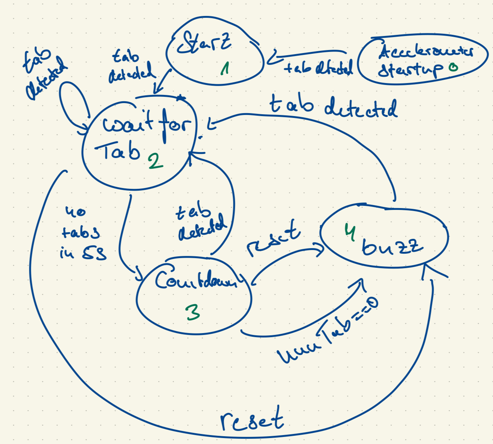

Name: Frederik Alexander Simon

PID: 10310072

# Lab 3

## Lab 3 Tutorial 1 

In this tutorial I learned:

* how to connect the OLED display properly and that it communicates over I2C
* You can create multiple tabs in the Arduino IDE for the same project that are combined at compile time and store frequently used functions in them for example
* functions to get the OLED display to work like '.begin', .setCursor() and that turning off the power save mode is helpful
* basic structure of how to write an CSV to the OLED dsiplay

It was fascinating to see a message appear on the display and that the given code was good to understand to do such a thing.

## Lab 3 Tutorial 2  

In this tutorial I learned 

* how to correctly connect the accelerometer
* that you need to use 'Serial.println(accelX) instead of 'Serial.print(accelX) to be able to read data on the Serial plotter 
* there is quite a lot of noise recorded by the accelorometer
* I could tell which is the x-axis of the accelerometer because there is a graphical indication on the device and if I move it in this direction I can see the graph on the Serial Plotter peaking
* There is at least an acceleration in one direction because of the gravitational force the earth asserts on the accelorometer. Depending on how it is rotated you get it in different and or multiple axes
* setting up a reusable accelerometer tab which helps you to setup and read the accelerometor and enables you to easily stream the data corresponding to each direction
* you can see in the serial plotter that the values for the x and y axis are relatively low if the accelerometer is not moved which makes of course sense. However, the acceleration in the z axis is measured to be higher because of the acting gravitational acceleration.

## Lab 3 Tutorial 3

In this tutorial I learned:

* you can affect the seen output voltage by using Pulse Width modulation (PWM)
* PWM is essentially switching the GPIO pin on and off at a rapid speed to make it seem that there is a lower output voltage 
* the percentage of the on time compared to the whole time is called duty cycle
* using PWM you can create the perception of an analog value 
* the higher the resolution the more realistic is the output because there are more states avialable
* use 'ledAttach' and 'ledcWrite' to achieve different voltage drops accros the built-in LED and therefore increasing or decreasing its brightness
* using the same functions for setting up a motor, the PWM frequency and resulution and control a simple motor setup

It is fascinating that you can control a motor and produce analog output signals with PWM while using only a few functions like 'ledcAttach' and 'ledcWrite' while toggling the pins with a frequency of 5kHz.

## Lab 3 Tutorial 4

* Sampling is a critical part for devices interacting with the real world
* converts continuous stream of data of the real world into 0s and 1s by evaluating analog signals at discrete time points
* Nyquist Sampling Theorem tells us that we have to sample at least twice as fast as the fastes changing part of the signal
* using non blocking timing to sample at a certain frequency which is checking if the sample delay has passed and if yes updating the values for acceleration
* displaying the samping rate using the imported display tap and dividing the total number of samples through the elapsed time since the sampling rate was last computed
* do not forget to calculate in appropriate units when using milli and microseconds 

## Lab 3 Tutorial 5

In this Lab I learned:

* setting up a Serial communication from python using the pyserial library 
* it is important to close the serial port at the end of the program
* how to send data and that it is important that at the end of a sent message there is a newline character because our program in the Arduino IDE is looking for this newline character 
* one way to avoid having to look for a newline character would be to implement a new timing mechanism that checks if sufficent time has gone by since the last character was avialable and then breaks out of the while loop
* receiving data which is sent back by the MCU and printing it out in the python console
* Unfortunately, the receiving part did not function at first try for me as I got often no printout in the OLED display and a None printed to my python console and at other times just a "lo word" in my python console
* After asking in the tutorial I learned that you have to flush your Input and Output and wait between the send and receive for a short amount of time and then everything works fine also with a baud rate of 115200 and via Bluetooth connection
* how to modify the Communication tab to enable bluetooth transmission
* to upload a sketch the MCU always has to be connected by cable to your PC 
* for my windows pc I had to find my bluetooth port by trail error with was a bit tedious
* when bluetooth is on the pins A0, A1 and A5 are inaccessible

## Lab 3 Challenge 1 

To complete this Cahllenge I did:

* imported Accelorometer, Sampling and Display tab
* set sampling frequency to 100 hz and sampled all 3 axis of the accelerometer:
 

* there you can see the graph of the z direction spiking when I tap on the accelerometer

* This make sense because a acceleration in the z direction is exactly what one would expect 

* based on these spikes I started with the assumption that if the acceleration reaches a digital value of 2500 a tap should be counted 

* because I also sometimes observed the graph spiking in the other direction I also implemented a lower threshhold of 2300 where a tap should be counted if az gets below this value

* through experimenting I ended up with a corridor of az 2480 and 2320 

* Additionally, check if the corridor is breached because of the startup of the acceloremeter when the MCU is reseted, then numTab should not be incremented

This works than as desired:

The weaknesses of my algorithms are:

* A large acceleration in the z axis as the  value would be over the thresholds for multiple loops. To solve this we could implement a short time where no tap is detected similar to button debouncing

* when you move with the accelerometer it should in theory be no problem if the movement is strictly in the x-y plane in the body coordinate system every other motion would trigger incrementing of the numTab variable

* However in reality this case is rare and therefore because of some motion in z direction it is realistic that the MCU would detect tabs because of  sufficient acceleration in z direction

* The same is true for external vibrations tabs would be detected without somebody actually touching the accelerometer 

* To solve this, one could try to filter out small motions and vibrations out using statistical methods  

* Furthermore my program does not account for different orientations of the accelerometer 

* To solve this: make the corridor dependent on the orientation of the accelerometer and determine the attitude of the accelerometer by comparing which axes are influenced to what amount of g which is fixed in the frame of the earth 

## Lab 4 Challenge 2

For the state machine of the gesture controlled I came up with this:

* As you can see there are 5 states and 4 triggers

* What I most importantly figured out by drawing this state model was that apart from state 0 every tab on the accelorometer leads to state 2 which is wait for another tab

* I have two start states because the accelerometer value are crossing my defined corridor when the MCU boots up and therefore a tab is detected 

* This for me results in the accelerometer startup state 0 and after this startup signal a start state 1

* The next time the accelorometer detects a tab state 2 is reached

* from state 2 only options are state 2 again if there is another tap, state 3 if there is no tap for 5s or state 4 if the watch is resetted

* When resetting the Watch via button it always goes to state 4

* Thus program checks only if a tap has been detected if yes and the previous state is not 0 it always goes to state 2 and increments the number on the display

* Same for the reset trigger if a reset is detected and the previous state is 2 or 3 it goes to state 4 and the Motor pin is switched to high to let the motor buzz

* detecting the reset is checking how long the button pin has seen a low voltage by using the non blocking mechanisms from the last Lab

* if the previous state is 2 and five seconds have passed state is set to 3 and countdown function is called

* the countdown function decrements the numTab variable every second until it is zero and then sets the state to 4 if not interupted by a tab on the accelerometer

Demonstration: 

[Presentation of Challenge 2](https://youtu.be/BYVg7kZC7fs)

## Lab 3 Challenge 3

The goal of this tutorial was to get a first experiece with using an API to get data from the internet and communicate this data with the MCU via Bluetooth. The task was to create a weather watch that displays date, time and weather of a location and switches the location when the button is pressed.

To achieve this I did:

### Arduino:

* setup the Communication and Display using the respective tabs given in the Tutorial 
* used the knowledge of last lab to detect a push of a button and
send pressed to my python program if the button was pressed and not pressed if there was no push detected
* Additionally the OLED display is refreshed when the button is pushed to prevent single characters to be displayed when they are not overwritten by the next message received
* if a message is received print it using the given CSV function if the message is not empty 

### Python:

* copy the functions for receiving, sending messages and creating and closing a connection from the pyserial tutorial
* establish a connection with the API using the PyOWM library and my individual key 
* get the weather data for the temperature and the detailed status of the weahter 
* Unfortunately the space on the OLED limits the weather characteristics I can visualize 
* Additionally in every loop get the UTC time and convert it with the help drom the datetime library into the time and date in the various cities 
* I am aware that there are libraries where I can get the timezones of cities with the help of functions I chose to implement it manually here 
* create an output string in the CSV format whichs contains all the data that the OLD display should feature 
* define a state variable that indicates which city is currently displayed and based on that state if the button is pushed and python receives consequently the message "pressed" send the respective string to the MCU
* I stripped the received message of any new line characters for the comparison to work but I had a issue where it tried to strip a message of value None which is why I have a additional conditional statement in my code preventing the stripping if the value is None 
* if the button was not pressed send the string of the current state to the MCU to update the data displayed
* the sending of the string is done by calling the printString function that based on the input state sends the right string to the MCU
* the function 'format_time' receives the date and the time and returns them formated as strings which then only are added to the string that is sent 

* finally close the serial connection if the while loop is exited

The main issues for me in this Challenge were, that I did not immeadiatly think of stripping the received message of the new line character and that I had to figure out that I had to reset the OLED display manually before switching the city becuase otherwise there were some characters displayed from the previous city that were not overwritten. As well as connecting my ESP to Bluetooth. 

Ultimately, the Weather Watch then works as desired:

