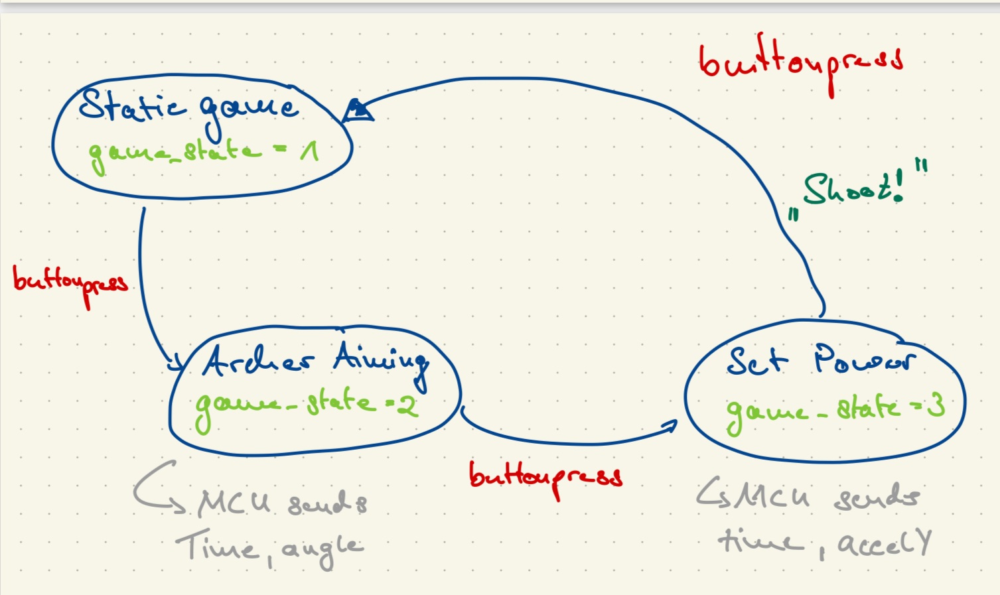
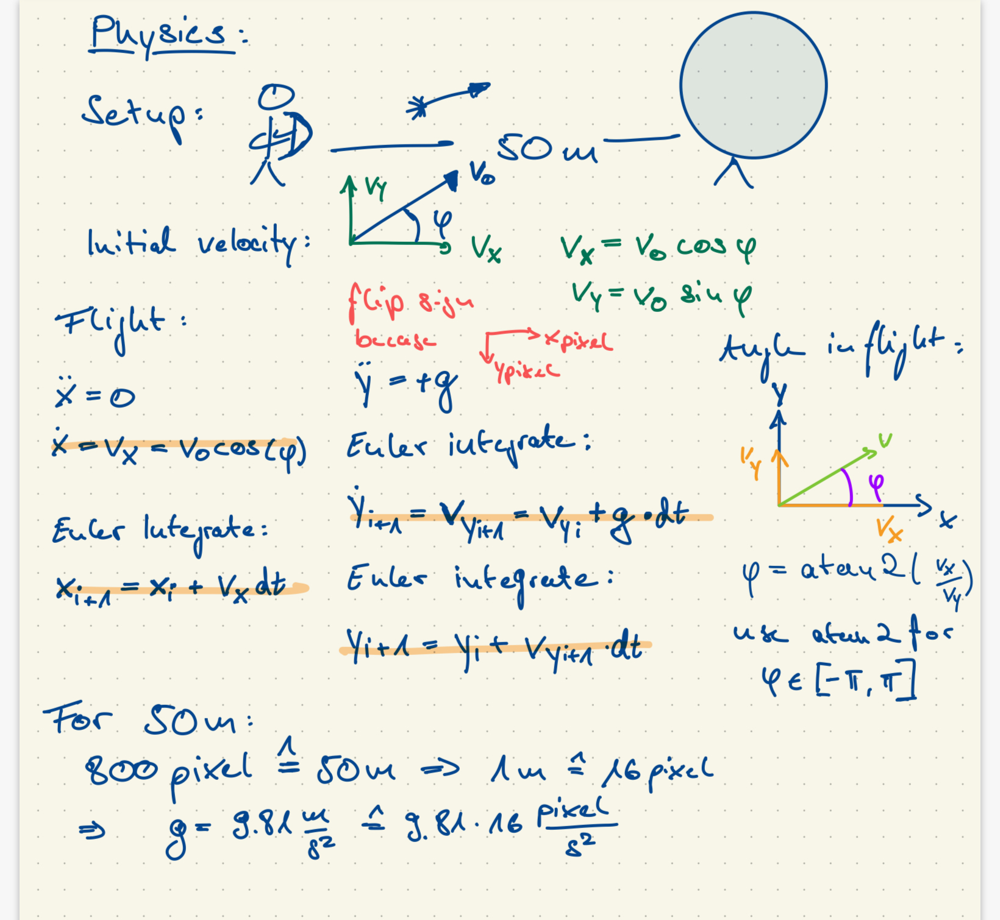

__Name: Frederik Alexander Simon, PID:10310072__

# ECE 16 Grand Challenge - Space Invaders Controller

A socket-based controller for Space Invaders to controller the game wirelessly with the ESP32.

The game is a modified version of Space Invaders based off of this project: https://github.com/leerob/Space_Invaders

You must have Pygame installed before being able to run the game: https://www.pygame.org/


## Challenge 1:

### Improvements: 

#### 1: Make Spaceship more responsive and easier to control 
* I made the Spaceship more responsive and easier to controll by implementing a timing mechanism for sending the commands over the Socket such that the Socket is not overflooded
* implemented a threshhold that prevents moving because of pure noise 

### 2. independent firing via a button

The idea is to have a button that can be pressed such that the Spaceship can simultanously shoot and move

* therefore the information of moving and shooting have to be transmitted at the same time 
* the arduino sends a message that contains a zero or a one in front of the comma and then the orientation integer after the comma 
* this message is then split, translated into commands for the space invaders game also in a CSV message and then sent over the socket to the game 
* before the comma "FIRE" is sent if the controller sees a "1" comming from the controller and a "NF" if the controller receives a "0" before the comma
* After the comma the Orientation is sent to the spaceinvaders game 
* in the game then the message is split again and then a bullet is fired or not fired depending on the content of the firt part and then the orientation is passed to the update_udp_socket() function to move the spaceship in the desires correction

## 3. Rounds counter 

Implemented a counter that counts the rounds that have been played to improve the HUD 

* increase the counter every time there are no enemies anymore 
* create a bool that tracks and makes sure that the counter is only updated once 
* set the rounds to 1 again if the game is over 
* display the rounds text every loop when the game runs


### New Features:

#### 1: Pause funtion 

* implemented a functunality where the game pauses and then resumes if the ppg sensor is tapped or "P" is pressed on the Keyboard 

* this is handled by the function check_paus, where first the input given is checked
* in this functions if the program receives a message that the player signalled pause the attribute ispaused is set to true or false respectively
* if a pause is signalled by the player the check_pause() function writes a message on the screen and returns true which then leads to a continue statement in the main function which prevents the game from updating and continuing 
* if the game is not paused the game executes as usually
* I had the issue that if I paused the game and then resumed the Enemies kept rushing to the position they would normally 
* With help in the tutorial I made sure that the current time kept updating by moving the statement to the top to ensure execution and correct upadating of time 
* Additionally I made the adjustement that the timer of the timer is set to the current time every time the update() function of the enemies is run 
* This ensures that after resuming the game the timing mechanism only moves the enemies once and then is up to date instead of executing all the movements that would have happend while the game being paused 

### 2: Lives displayed by three LEDs and also on the display 

* check the remaining lives by checking the length of the livesGroup that contains the three lives
* take the adress that is saved when receiving a message and then send a response over the udp socket
* only send the remaining lives to the controller if they have changed to not sent uninmportant content over the socket
* therefore add a attribute in the SpaceInvaders class to track the previous lives and declare it as 0 so that also the "change" to 3 lives is sent to the MCU 
* in the Controller try to receive a message and if it receives a message and the lives are different from the 
previous life sent the number of lives to the MCU
* in the MCU receive the messages, print to the display and power the necessary pins to display the right ampunt of lives with the LEDs 


### 3: Display Top-scores on OLED at the end of the game 

The basic idea of this feature is to store the high scores in a text file and then once the game has ended display and display them on the OLED 

* and the end of the game send the score to the controller 
* track if the high score has already been by introducing a bool self.displaye_score to avoid multiple sending of the same highscore leading to issues in the storing process
* the highscore is identified by a "!" in front of the message to distinguish it from other messages 
* in the controller program initialize an attribute self.top_scores that stores the top scores
* in the constructor therefore the previous high scores from a txt file are loaded and if the file can not be found it is simply set to a all 0 array 
* if the controller at the end of the game receives the score from the round it calls the update_scores() method which appends the current score to the high score array, then sorts the array and then takes the first three of the sorted list 
* then write the the scores to the txt file and create a string that is sent in csv format to the csv and there displayed with the dsiplayWriteCSV function


## Demonstration:

[demonstration video for Space Invaaders Controller, final project Challenge 1](https://youtu.be/Ms41H_-O5GA)

* LED and OLED indicating lives 
* smoother movement 
* independent shooting 
* round indicator 
* Display Top Scores and end of the game 
* Pause function


# Design Challenge: Archery Game 


## Need 

### Use Case

* motion controlled games are not accessible on pc
* only with expensive equipment  or a console and additional equipment 
* provide a relatively cheap and easy solution to be able to do so

### Worth Adressing 

* motion controlled games on consoles like for examples on the Wii are one of the most famous Coop games when doing a game night with friends or family 4
* fancy features and very good graphics not the most important feature of such games 
* focus on an easy game that works good and provides a group activity 

### Intended Users 

* Families and Party Gamers 
* the archery game can be a fun party game where you compete against your friends and family 
* Developers and DIY Gamers who take it as a baseline to add cool features and customize it 
* Casual Gamers who want to enjoy a motion controlled game 

### Adressing of their Needs 

* Easy game setup 
* minimal Equipment with only an MCU a Laptop and a Accelerometer 
* Simple to understand and play
* Easy to add features and experiment with  


## Implementation
### Inspiration

I found a good tutorial for an archery game which provided me with the basic framework for the game and showed me how to utilize Pygame's Sprite Class to create the key elements of the archery game while enabling key features such as reusaility and organized code. Especially helpful were the basic event loop and the Sprite class for the target. The only exposure to pygame for me was the Challenge 1 of the final project so this very organized and basic approach of the article was really helpful.

[Gold, M. (2023, December 6). Get started with PyGame to create video games. Medium.](https://medium.com/@msgold/get-started-with-pygame-to-create-video-games-85a2bb5678e6)


### Basic Idea

The basic Idea is to have an archer who shoots an Arrow onto a target, where the initial speed or force and the angle is determined by the user input via the MCU. As seen in the drawn state machine, first the game is static to allow the user to pick up the MCU and postion for playing the game. After the button has been pressed now the MCU sends the time and the angle and the archer is rotated according to the angle sent by the MCU. When pushing the button again the angle is locked and the process of aiming completed. This is done because the angle is determined by the IMU's accelerometer data and if one would combine motion with the angle measurement it could lead to faulty angle measurements. Additionally to the angle being locked,while game state is 3 the power with which the arrow is shot is also evaluated. To simulate a drawing motion the idea is to set the initial speed of the shot proportional to the amount of acceleration the MCU is being pulled back. 




### Visuals 

This is what I did to achieve the visual output of the game:

For the images I asked ChatGPT to generate me a cartoon like archer who wears a medival robe, an arrow and a backround which follow the cartoonish style and then removed the backround from the archer and arrow pictures 


* initialize pygame, get the file path for images and define colors 
* setup the display with defined height and width and the game clock
* load images such that the game recognizes that the backround has been removed 

##### Archer, Arrow, Target visuals:

* create an Archer class which has a draw method
* the draw method takes the loaded images rotates the picture corresponing to the attribute ```self.angle ``` and displays it on the screen 
* this leads to the entire archer object being rotated on the screen when the 
* create an Arrow class which has a similar draw method depending on the position of the arrow and also the angle 
* create a Target class with a draw method that draws concentric circles in different colors
* the target radius is a input when instantiating an target object

### Arrow Physics  

To model the physics as clearly as accurate as possible I said that the setup of the game is that the 800 pixels of the window correspond to 50 m.

* this leads to a gravitational acceleration of 9.81*16 pixels/s^2 
* otherwise I would have to experiment how to set the gravitational force and in choosing this analogy it helps me set this parameter  
* when an object of the class arrow is created the speed and the angle have to be passed to the contructor 
* the constructor then calculates the initial velocity in x and y direction with the initial angle 
* the next step is to formulate the equations of motion in python analogous to the picture of my calculations
* the movement of the arrow is handled in the move method 
* to achieve this first the time difference to the last iteration of the method is evaluated
* if the atrribute self.moving is set to True then the x position, the volicty in y direction vy, and the y position are updated by means of simple numerical Integration
* also the angle of the arrow is updated to have a realistic animation of the arrow flying 
* as a last step it is checked if the arrow has flown out of the picture and if yes it is set to inactive or if the arrow has hit the target 
* if it has hit the target self.moving is set to false to keep displaying the arrow on the target 




### Determine Angle of MCU:

* my initial idea was to use an IMU an leverage the gyroscopes in combination with the accelerometer to get a reliable angle measurement 
* because the gyroscope data has to be integrated and therefore introduced a time lag for large deviations of attitude of the MCU I chose to only use accelerometer data in order to have a more instantanous measurement of the angle 
* therefore I also could have just used the accelerometer provided in the class but I chose I try to get IMU to work 
* because this involves wire communication because the IMU communicates over I2C I got the code from the internet and implemented in our already existing infrastructure by creating a setup function and a read function which I call in the sampling tab 
* the readMPU6050() function then updates the RollAngle which is the angle I need based on how I positioned my MCU on my breadboard
* this angle is then sent to python

[Alam, M. (2023, November 26). Measure tilt angle using MPU6050 gyro/Accelerometer & Arduino. How To Electronics.](https://how2electronics.com/measure-tilt-angle-mpu6050-arduino/)


#### Determine initial Velocity (Power)

* Also for determining I had a different solution in mind than I made work in the end 
* Initially I had thought about integrating the accelerometer data twice to get some sort of displacement in the end 
* But I had really bad drift issues over time trying out that solution although i tried to apply filtering to the data including a lowpass filter 
* I changed the mechanism to simulating a quick drawing motion and looking at the acceleration in the IMU's y axis 
* To achieve this I added circular lists as attributes to the archer class which store the incoming MCU data if the game state is 3 
* I implemented the filtering process we have been using in the Labs this quarter which includes a add function which adds the data to the circular lists
* Additionally the process method which filters the new incoming data by detrending, taking a moving average and the gradient and then stores the filtered data 
* To determine the power of the users drawing motion I set threshholds 
* there are 4 power_states which correspond to 3 thresholds 
* if one of the threshholds is exceeded in the current filtered data the attribute self.power state is set accordingly 
* one problem I have is that I clear the circular_lists after the arrow is being shot and therefore for any new arrow the gradient between the first data point and the last 0 gets really high and sometimes already sets a power_state 


### Running the game 

#### Python: Archery Game class: 

* initialize the archer the target and an empty list which stores the arrow objects 
* setup the communications  

* I created a game class simply because it makes it much    easier to have the game_state available everywhere as an accessible attribute and not having to pass it form function to function 
* also create m1 and m2 as attributes which represent the data received also because of accessibility 

##### receive data() method 
* create a receive method which tries to receive a message from the MCU 
* if it gets the signal from the MCU that the button has been pressed it cheks if the game state is 3 which is the state where the initial velocity is set 
* if yes then set the power of the archer according to the power state which results from what threshhold was exeeded 
* Additionally create an Arrow object with a slightly different position than the archer, the locked angle and the power or initial velocity of the archer 
* reset the circular lists of the archer and reset the power state 
* Furthermore, independently of the game state increment the power state and send the game state to the MCU 
* return False to indicate that no angular or accelerometer has to be processed
* if the button has not been pressed try to receive angular or if game state is 3 acceleration data 
* return True if data has been received otherwise false 

##### run() method

* this is where the game is essentially run
* display backround picture 
* if there is data to be handled set the angle of the archer archer to the angle received if it is angular data or process accelerometer data and optionally plot it to debug
* handle input by keyboard by calling the aim() method if the left or the right arrow is clicked and in the aim increment the angle of the archer resulting in rotation by pressing the arrows 
* shoot an arrow if the space bar is pressed down 
* draw the arrows and the archer 
* call the move function and remove every arrow that is not active 
* display new frame and tick the game clock by the defined FPS 
* if the run method terminates close communication

##### execute 

* instantiate ArcheryGame object and call run method 

#### Arduino

* setup the usual things as well as the button pin and the MPU6050
* in the loop check if there has been a button press by calling the detectButton() functions which sends "pressed" to python if its true
* try to receive a message from python and store it in the command string
* if the command is "sleep" set sending to false and send no data 
* if the command is wearable start sending 
* any other meaningful message must be a game state update from python 
* set the Arduino gameState equal to that received in the message 
* if the arduino is sending and sufficient time has been passed to avoid flooding the bluetooth connection with messages send data
* if the gameState is 2 send angle data
* if the gameState is 3 send accelerometer data 


## Demonstration:

[Youtube video demonstrating the capabilities of the game and Controller and discussing the needs, worth of adressing, intended users and adressing the needs](https://youtu.be/0BRT4dxFUkE)

## Possible Improvements: 

* add a scoring system 
* add a shooting animation
* aim just with rotating arm and bow 
* game and pause interface 