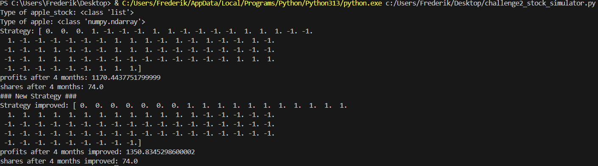
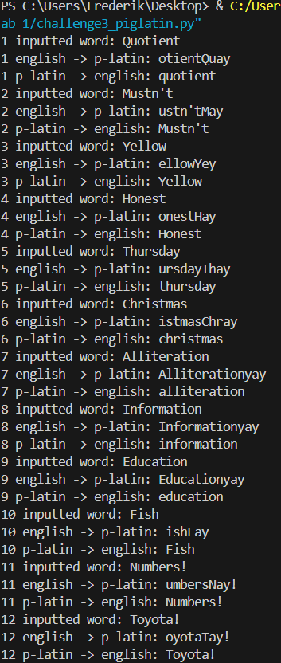
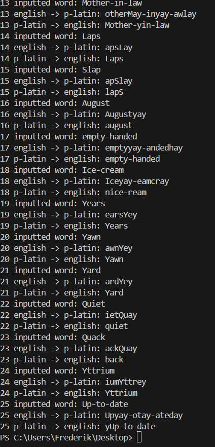

Frederik Simon 

PID: 10310072

## Lab 1 Tutorial 1 completed 

To complete the Lab 1 Tutorial 1, I installed python directly from python.org and also installed the python extension for Microsoft Visual Code. I tried to execute my first program using the 'python3' command wich I had used on my previous devices to run python, but it did not work for me. After researching with the help of the internet, I discovered that there is no need to use the 'python3' command. I can just use the 'python' command which automatically points to Python 3.

## Lab 1 Tutorial 2 completed 

In the Tutorial 2 I mostly learned about List Slicing, List Comprehensions, strings in python and looping over lists. I had backround knowledge of how to initialize and modify list and it was interesting to learn how easily you can access multiple entries in a lists simutanously and manipulate them element wise. From the tutorial section about strings, the most memmorable part for me was learning about the split operation of strings, which makes it easy to break a string into parts based on a delimiter. Additionally, knowing that the python interpreter sets special variables such as '\_\_name\_\_', which can be used to determine if the module was imported from another module, could also prove to be very powerful in the future.

## Lab 1 Tutorial 3 completed 

The content of Tutorial 3 was an introduction in the NUMPY package, which is an numerical computation package. I mostly learned about different ways to initialize new arrays for example from a list or as an array full of zeros, restructuring and resizing them and also how to slice and use the indexing notation.
After reading and trying out the contents of the tutorial I solved the Questions that were given to test the knowledge gained by the Tutorials two and three.

__Questions 1__ and __2__ were simple list to array conversion and indexing

In the proccess of solving __Question 3__ I had some sytax problems because the cascaded stacking required a precise placing of brackets, where there has to be a double bracket around the argument of the first horizontal stacking:

```python 
array3 = np.vstack([np.hstack((array1, array1)) for _ in range(4) ])
```


The __Questions 4 and 5__ asked you to explore the difference between the methods 'arange()' and 'linspace()' which both initialize an array. The difference between them is that you specify the step size for 'arange()' and for linspace you specify the amount of steps taken in the intervall. In Addtion, the specified upper boundary of the intervall is included in the array when using 'linspace()', but not when using 'arange()'. Furthermore, what I learned is that if using 'arange()' with declining negative numbers, the step size also has to be specified as a negative number, regardless if the intervall implies a negative stepping direction.

For __Question 6__ I wrote down my array and then set the nonzero values to the correct values.

To solve __Question 7__ I split the string by the commas and specified the datatype as integer to avoid the array being initialized with floats or strings:
```python
row = np.array(string7.split(','), dtype = int)
```

At a last step I stacked the array a hundred times to obtain the desired result.


## Lab 1 Challenge 1 completed 

The objective of the __Challenge 1__ in the Lab 1 was to get familiar with working on and with lists, loops, if statements and logic controls, Error Handling, Assertions and Functions. First the goal was to understand the concept and then to apply the gained knowledge in several tasks.

For the __Exercises 0.3__ two lists should be initialized with different datatypes as content, then the diffferent lists should be manipulated and
joint using different methods. In addition to that, I checked if I have initialized the lists the right way and if the numbers in the lists have the right datatype. One thing, I was reminded of in this exercise is that you need to be careful how to copy your list:
```python
list_1_copy = list_1 #list_1_copy is just a pointer to list_1
list_1_copy = list_1[:] #actually copies the list
```
For the last two Questions, you had to find a way to append new data to an existing list that has a fixed length. I did this with the help of slicing and defining a length to keep of the existing list, which depends on the size of the new data and the already existing list. The kept data is copied in the beginning of the already existing list and the new is appended after. For the edge cases, when a different datatype than a list is passed to the function and when an empty list is passed, I implemented if statements that return an Error message or an empty list respectively. 

To complete the __Exercises 1.4__ you have to create a lists with commands as strings and loop over list printing the elements to the console using both a for and a while loop. Clearly, the for loop is the most convinient to use as you can easily loop over lists and other items. When using a while loop you often have to define a variable that controls how often the loop should be executed. 
Additionally, I learned the difference between using 'in' and '==' when comparing strings. Whereas 'in' compares the whole string to a second string, '==' compares the string character by character to another string. When you use the escape character '\' in a string it introduces a special character after it, thus the last logic statement evaluates to 'False'.
Using this knowledge I solved the last excercise, by looping over a given list until the string "SUCCESS" occurs in one of the entries and then braking the loop and printing "This worked!".

The goal of the __Exercises 2.2__ are to get familiar with how to handle Errors and also catch them and make your code robust. To solve the Exercise 5, the function tries to decode the input variable from a byte array to a string, if this fails and a UnicodeDecodeError arises, the function returns an empty string.

## Lab 1 Challenge 2 completed

The goal of __Challenge 2__ was to get more familiarity with operating with NUMPY and especially ndarrys while working on a problem that is related to the real world. 
For this the prices of the apple stock from 01/01/2019 to 04/30/2019 were given and we were tasked to find a algorithm that trades the apple stock based on evaluating the average value of the last three trading days. First a strategy array was created and populated by evaluating said average value of the last 3 days and then deciding if to sell, hold or buy share. This was indicated by populating the strategy array with the values -1 , 0 or 1 respectively. 
To get the profits achieved with this simple technique I just used a neet property of NUMPY. That is the multiplication of two numpy arrays is done element wise. Therefore by multiplying the strategy array and the apple array, where the stock prices are saved and summing up the entries of the resulting array, you get the profits you have made in the 4 months. One thing I struggled with, was that you have to negate your product before summing up because if you sell and print a "-1" into your strategy array because you sold a share. But, when looking at your profit you have have to account for a increase, vice versa for buying a share. Additionally I also computed my resulting shares by summing up the elements in the strategy array and summing the result up with the shares that I had at the start of the task. The last task was to improve the program such that the trading gets more profitable.

For improving the code I had the ideas to implement a stop loss fuctionality and secondly, to take a larger amount of days into account, when computing the average. I implemented the second idea with the additional condition that I begin to sell my stock 50 days before the four months end to have a net profit in cash and not just in stock. Thus, I just increased the waiting period at the beginning due to insufficient data and increased the elements to average while also implementing the 50 days selling period. Together with the original program the output printed in my console is this:



In reality you would of course keep buying longer and sell larger amounts of stock at the same time when you think a peak has been reached, to maximize the cash profit here I decided to begin selling 50 days before the deadline to have some cash profit. However if you would take the method of the 7 days average and sell all your stocks on day 81 the profit would be much higher.

## Lab 1 Challenge 3 completed 

In the __Challenge 3__ the goal was to design a Translator that transforms english words to pig latin and back into english and in this proccess training the brain to think like a programer.
The rules for pig latin are relatively striagthforward, when leaving out the edge cases. When the word starts with consonants, these consonants should be shifted to the back of the word followed by an appended "ay". If the word starts with an "y" the same rules apply for the consonant but an "ey" is appended. If the word starts with a vowel, simply a "yay" should be added at the end.
To solve this problem, I first created a string with all the vowels and used the keyword 'in' to check if the first character of the input string is either a "y" or not a vowel, subsequently then a consonant. If its a y i set the boolean 'y_start' to True to later append the right ending string. Either way I copy the consonants with the help of a loop to the back of the word until a vowel is at the beginning of the word and then append the right string. If the input string has a vowel as a first character right away I just append "yay".

To treat the edge case that hyphenated words should be translated word for word I created a second function named 'translate()' which does basically all the translating and the english_to_pig_latin() splits the inputs, calls for translation and pieces together the results. Additionaly I have two If loops that cover the edge cases that if the letters "q" and "u" appear together they should be also treated together and that punctuations should also be copyed at the back of the word. Furthermore there is also a break statement in the while loop that monitors if there is a "y" followed by a "e", because then the y mostly acts as an vowel and should not be copyed at the end.

I struggled at first with the words which were beginning with "Y" because I accounted only for lowercase "y" and also with words that were hyphenated multiple times because in the beginning I had just implemented a solution for once hyphenated words. But in the end all words are translated correctly from english to pig latin.

To convert the string back to english we can use a dictionary to make it easier. I choose to use 'pyspellcheker', because it was relatively easy to install for me. For the translation I first catch the punctuations as well as the specific endings from the words and keep track if the word starts with a "y" in english. Then if it is a word that starts with a "y" in english I simply shift all the characters back until the word again starts with a 'y' and try to find it in the dictionary. If it does not start with a "y" I simply shift one character back and see if the word can be found and if not I do this again and again until the word is found or ten iterations have gone by. This is my console output for the __Challenge 3__ in two pictures, because the output was fairly big:

,




My algorithm to translate piglatin into english does not work perfectly for all edge cases as sometimes not the right word is recognized.


