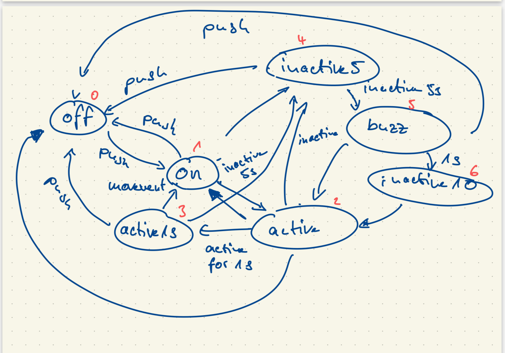

Name: Frederik Alexander Simon

PID: 10310072

# Lab 4 

## Lab 4 Tutorial 1

In this tutorial I learned:

### Part 1:

* create a class with multiple attributes and methods 
* intantiate an object wtith the constructor
* first argument of a function is always the elf argument 
* definition of encapsulation


__Question 1:__ the outpout is a pointer to the memory location where the instance is stored

__Question 2:__ An error appears which says that the dog object has no attribute '__breed'. This is because the attribute is encapsulated which means it is not accessible from the outside without a method that provides acces to it 

__Question 3:__ instantiate skippy, make him a buddy and print his description via scout:

```python

#instantiate skippy
skippy = Dog("Skippy", 2, "Golden Retriever")

#make skippy and scout buddies
scout.define_buddy(skippy)

#printout skippys description using the fact tht he is a buddy of scout
scout.buddy.description()
```

### Part 2:

* creating an own python libraary that contains the communication class 
* the communication class allows us to create our own connection as an object of the class that then has the methods we have discussed in Lab 3 
* a clear method is added to reset the input buffer 
* installing the library
* using the library and the class to establish a bluetooth connection between our pc and MCU and sending data back and fourth resulting in a counter on the OLED display 
* the counter counts to 30 and sends each messsage back to python printing it then out in the console 
* try block to run our main function, to handle a keyboard interrrupt and to cleanly exit the program while ending the connection

## Lab 4 Tutorial 2

In this tutorial I learned:

### Part 1 

* using matplotlib to display simple graphs an numpy arrays 
* adding title and labelling axis
* adding multiple plots in the window by using the subplot() function and its arguments to determine the size and position of the subplot


### Part 2 

* plotting the accelerometer data that is send frome the MCU 
* using our own library and matplotlib to send and receive data and to plot the 3 axis in one window
* introduce a boolean to determine if data should be sent to python, if yes send "wearable" to the MCU which sets the boolean to true if "sleep" is sent stop sending data
* sent limited amount of samples
* try, exept block to also account or keyboard interrrupt
* the OLED monitor displayed either "sleep" or "Wearable" an the Sampling rate


## Lab 4 Tutorial 3

In this Tutorial I learned:

* circular list are fixed size lists that behave like a First-In-First-Out buffer 
* we do not want to manage array sizes or constant memory allocation
* implement a class CircularList which inherits from list
* after making any changes to your library you have to reinstall it 
* decouple the sampling from the plotting by storing the incoming data as fast as the BT allows and plotting as fast as matplotlib can 
* do this in a circular list to be sure that the most recent data is plotted 
* for me a refresh tiome of 0.05s worked well to see my acellerometer data in real time


## Lab 4 Challenge 1

Goals of this challenge:

* get a better understanding of the data by transforming the data and plotting it 
* getting familiar with the CircularList class to be able to store data and plot live 
* plot live data adjusting the average time over which the average_x is averaged

To achieve this I did:

* implemented additional circular lists 
* computed the norms stored it in respective circular lists 
* defined 3 functions to live plot the raw data 
* for the transformation we should choose ourselves I chose the sum of the unit components as it gives us a sense what type of motion is exerted on the accelerometer 
* for example if the sum of the normed components is roughly +1 or -1 it indicates that the motion is along a axis 

### Questions:

__1:__ a value of N = 5 worked good for me providing a smooth signal without any heavy loss of data

__2:__ you can tell how much the accelerometer is moving overall, so if you want to detect a motion and you do not know in which direction will be or it will be in multiple directions in the acellerometer body frame you can check if the norm exeeds a certain value 

__3:__ Yes, they did. Especially the L1, L2 norm and the one I chose made me realize that it is unpractical to look at each individuall axis when we want to detect a motion of certain intensity type

__Raw Data plotted:__


__Delta x and average x plotted__


__L1 and L2 norm and sum of unit components:__


## Lab 4 Challenge 2 

to build an Idle Detector i did the following state machine:



* what i learned is that every time the button is pushed the state either goes to the off state or the on state 
* always when a activity is detected the machine goes to the second state 
* if the active state is active for more than 1sec it goes to the active1sec state and 
* if any state of the 3 detects a 5s inactivity it goes to the inactive5s state which after another 5s goes to the buzz state 
* buzz state buzzes motor for 1s and then goes to the inactive10 state 
* any of the inactive states can go to the active state if movement is detected 

This in code is realized:

* detect if a button was detected in the Arduino IDE, then send a message to python to toggle the state of the IDLE Detector 
* read commands and display a message, buzz the motor or blink the LED respectively to the state 
* in python receive the sampled data, check if it is a button press or the data from the accelerometer 
* add the data to the circular lists and compute the norms 
* check if the threshold was reached and if the state 2 has been active for 2s if yes go to state 3  
* check if there is inactivity for 5s and then set the state to the inactivity5 or buzz state 
* track the buzz time and if 1s has passed go to the inactivity10 state if no activity has been detected 
* send a message to the MCU depending on which state is active
* I ended up experimenting a lot with norms and I arrived at using the difference of the last 2 L2 norm samples with a threshhold of 30 
* I stored these values also in a circular list 


Unfortunately i had huge problems in detecting a consistent state active because the measures I tried did not work at first for me and also my motor did not quite work that is why I changed it with an LED.

In the end it works pretty good:


## Lab 4 Challenge 3

The Goal of Challenge 3 was to create our own Idle Detector class.

__1. Implementation decisions__

* imported the Communications and Circular List class 
* created a Communications attribute and initialized the circular lists needed for the idle detector
* define the state attributes and other attributes 
* define a method that processes the message and processes the button press and adds the values to the Circular list 
* detect motion method to detect if the idle detector is moving or not and taking the difference of the L2 norm of the actual time and that 3 time steps ago
* this method calls the send message method and is called by the process message method to have multiple methods and more organization 
* define a encapsulated send message method that is not accessible from the outside to send the messages to the MCU to communicate the state of the idle detector


__2. Weaknesses in my code__

* my code takes a lot of movement to detect a motion over a second without jumping bak to the on state and resetting the timer 
* this could be solved by a more sophisticated threshold or a more sophisticated measurement of the movement of the accelerometer 
* for example one could take a dynamic threshold and adjust on the average noise in the last x samples and compare this to the standard deviation of the L2 torm 
* maybe this would lead to a better detection of movement 
* messages are sent and received in every loop this can lead to a Problem because of overwhelming the bluetooth conncetion 
* I could implement that the messages are only sent when there is a transition in states 


__3. Compare code of Challenges__ 

* in challenge 3 my code is a lot more organized because I was thinking a lot more about how to structure my code and also for me OOP forces me to do so 
* for me the Challenge 2 was easier to write because for the Object Oriented programming you have to think a lot at first of how to implement your code 
* One disadvantage is maybe that with OOP you have to really understand the concept and the topic and if you do not you can make very fundamental and critical errors that consequently can impact a lot of code
* the big advantage of OOP is the organizational aspect and that you save a lot of time because you make your code snippets easily reusable 


