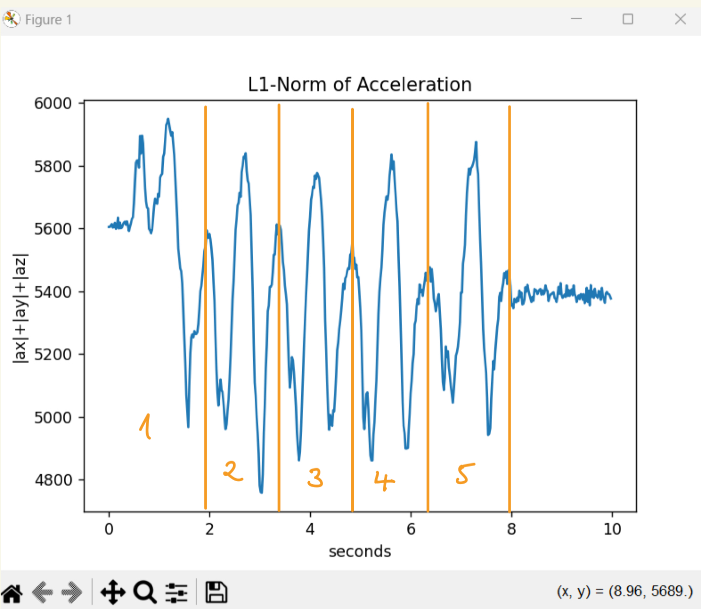
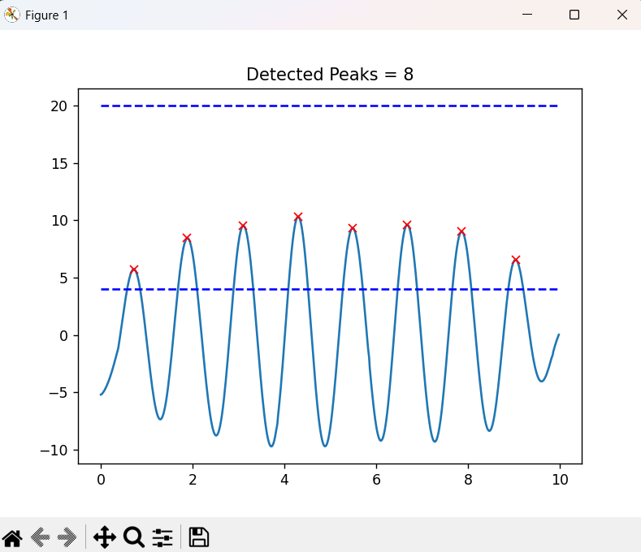
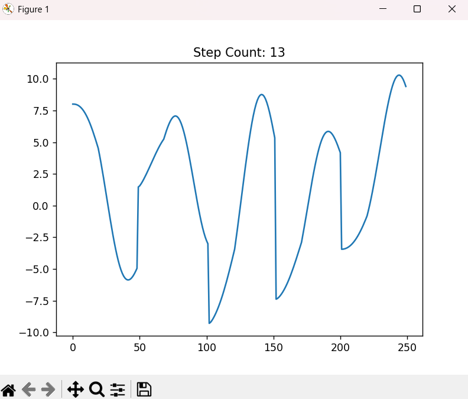
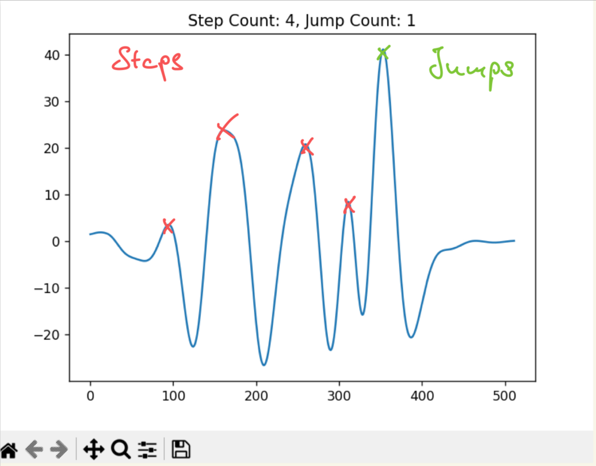

Name: Frederik AlexanderSimon#

PID: 10310072

# Lab 5 

## Lab 5 Tutorial 1 

In this tutorial I learned:

* the numpy functions savetext which saves an array into a a file seperating each entry by a comma 
* genfromtxt is the reverse operation that loads the data from a csv file into an array
* how to define a function that collects 10s of data and outputs a 500x4 data array
* collect good data for L1 norm
* for this I took exactly 5 steps multiple times until I got good data and then identfied the 5 steps on the plotted L1 norm: 

__Plotted L1 norm for exact 5 steps:__

## Lab 5 Tutorial 2

in this tutorial I learned: 

### Part 1: 

* take the L1 norm to detect motion even if we do not know in which direction the acceleration wil occur 
* smoothing the L1 norm by computing a windowed average
* smooth the data by applying a moving average filter 
* detrending the signal by substracting the moving average from the data removing the mean of the signal in chunks
* compute the gradient of the detrended signal 
* the gradient makes the signal noisy again because at the peaks the gradient is very steep and changes direction very fast this can lead to error in computing the gradient
* compute the power spectral density (PSD) of our signal by using 'sig.welch()'

* __Questions:__ If the sampling rate was 120Hz the maximum observable frequency component of the signal would be 60 Hz 
* If the signal bandwith is composed of 0-10Hz the minimum sampling rate that captures the signal is 20Hz, recommend is four times the nyquist frequency so 40Hz

* apply a lowpass filter by using the 'butter()' function to compute the filter coefficients and use lfilter() or filtfit() to filter the signal 

* find peaks with the SciPy function 'find_peaks()' and loop over the peak list to determine which peaks are relevant for us 

## Part 2

* create a module of nice organized code which is reusable and includes all the functionalities we have used so far 

## Lab 5 Tutorial 3

In this Tutorial I did:

* create a Pedometer class and import most of the structure 
* define a procedure to process the incoming data 
* imported the structure for testing the Code Offline and Online 
* tested the pedometer with Offline and Online data 
* adjusted the thrshholds according to the processed data 

This is the plot I got from processing the offline data and detecting the peaks:

## Lab 5 Challenge 1

The goal of Challenge 1 was to create your own pedometer by extending the Pedometer class which structure was given in the Tutorial.
The main thing was to choose the way the Signal should be processed.

My filter process follows the suggestion made in Challenge 1:

* the signal is first detrended using the moving average to substract the parts of the signal with low frequency to make sure we capture only important data
* the signal is then filtered using a low pass filter to filter out any high frequency noise 
* the gradient of the signal is computed to highlight steep changes and therefore detect the peaks better 
* in the last step the moving average is computed to smoothen out the data 
* detect peaks and count the steps using the dsp module 
* send the step counter to the MCU and display the step count 

using this data I then detect peaks using our filtering package

* I varied a bit with the threshold and ended up with a lower threshhold of 3 and a high threshhold of 50 
* this is significantly lower for the lower threshhold than in the tutorial 
* probably this is because I use the gradient in my calculation wheras the tutorial does compute the gradient but does not use it in its further calculation

With this processing routine I get data that looks quite good:

* there you can also see why I set my lower threshold to 4 and that my processing of the data works good the peaks are steep and the data is quite smooth 

* The recognition of the peaks also works although it is sometimes a bit unreliable

As i worked alone on this Challenge I submit only 1 gif to demonstrate that the online peak detection is working:

Together this works as live pedometer to count the artificial steps I took, to be able to record better:

[This is a video of the pedometer counting 6 steps correctly](https://youtu.be/7o-dIJVi7og)

## Lab 5 Challenge 2:

The goal of Challenge 2 was to improve the step counter such that it can also count jumps and can differentiate between jumps and steps.

To implement the desired logical flow, I implemented:

* an integer Arrays for all three accelerations where the data is stored 
* if the python sends the "wearable" command the data collection is started where the i-th component of the Arrays is updated with the current accelerometer measurements 
* i is updated such that it resets after reaching the end of the array
* this can be done by adding a modulo 512 to the updating statement which evaluates to 0 when i reaches 512 creating a circular buffer
* when the button is pushed once the boolean sending is set to true and the MCU sends the data to the pc and stops recording data
* it sends the data by looping over the array and sending the ith component first because this is the oldest data and then loops over the array sending the data in the right sequence 
* Python receives the message consisting of the time and the three accelerometer readings and adds this data to the insantiated pedometer object
* using the pedometer object the data is then processed in the same way as described in the challenge 1 
* the difference is that I added an additional two attributes to the pedometer class that are the threshholds when the program should count a peak as a jump 
* added also a additional return value 'jumps' to the process method of the pedometer class which is the times how often the program detected a jump 
* if the button is pushed again the arrays are reseted and the program starts again to collect data

* I got the error that the input vector x must be greater than padlen, which is 12 when sending the data to my pc
* after researching I found out that the input vector of filtfilt() has to be larger than a certain number that is determined by the order of the filter that is applied 
* I tried to solve this by checking if the of the new data array exceeds 12 and only processing the signal if its larger than that
* In my opinion the error was occuring because as soon as python was seeing data it began to process the data having to few samples

* Additionally I had the error that my program just received 0 as a value
* The solution I got after asking in the tutorial was to only process the data if I received all 512 data points of the array in python and then updating the step and jump count 

* for the logic I implemented a workflow with states
* after the MCU is activated it is in the Collect state 0 which means it collects data after the button is pressed it goes into sending state and after finishing the sending it jumps into display state 
* if the button is pressed again after, the buffer is set to zero and the MCU jumps to the collect state and records new data 

* I updated the thresholds of the count and the jumps that from 3-30 it is counted as a step and from 30 to 100 it is counted as an jump

The algorithm then detects the difference of steps and jumps:

This is how the algorithm works in action:

