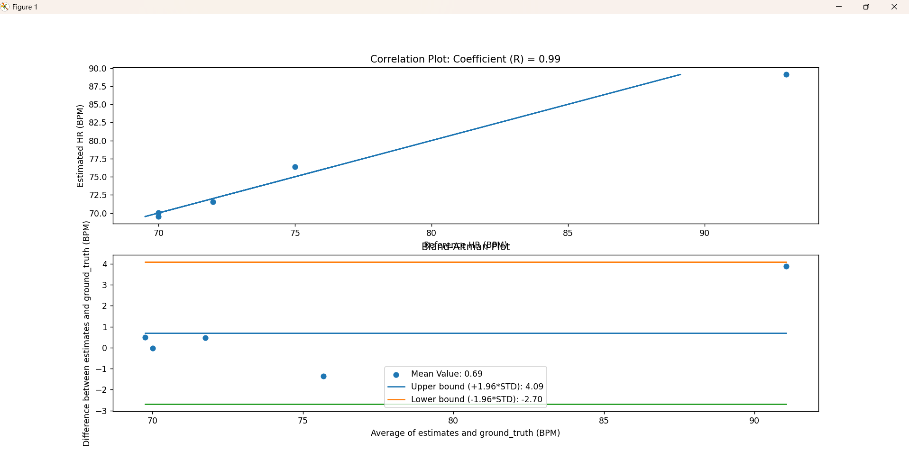
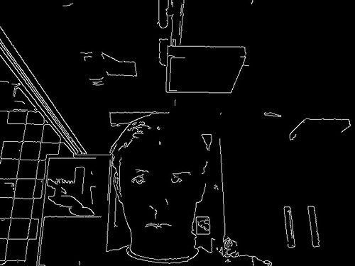
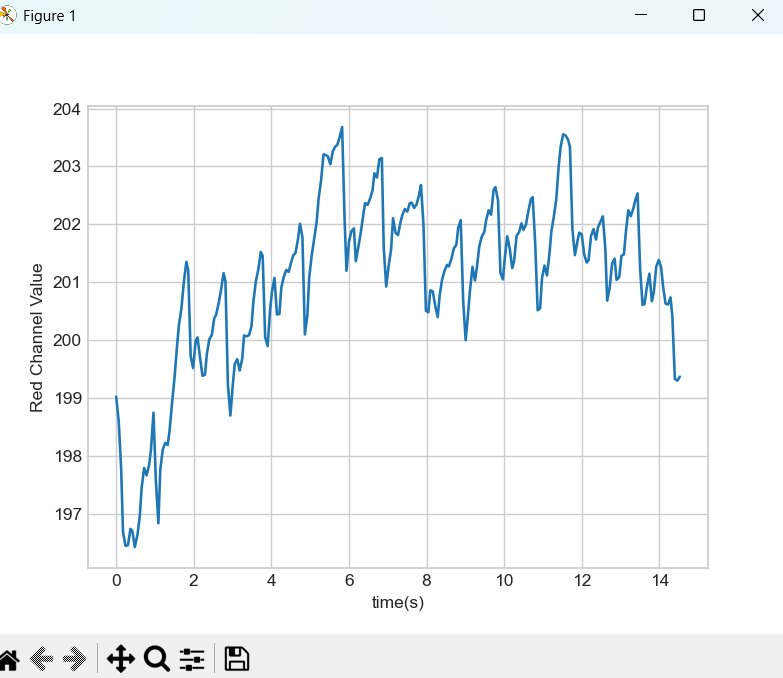

Name: Frederik Alexander Simon

PID: 10310072

# Lab 6 

## Lab 6 Tutorial 1

In this tutorial I learned:

* how Photoplethymography (PPG) detects volumetric blood changes by shining light of a particular spectrum into a volume and measuring the properties of the reflected light 
* an overview how we would built our own Photodetector by taking a light source, a light sensor that converts received light at a specific wavelength into a small current and a amplification circuit to produce an adewuate signal for our ADC 
* how to connect the MAX30101 sensor
* test the board with example sketches provided by the library

__Questions:__

* I can connect both the OLED display and the photodetector to the same pins of my board because they use I2C connection wich always sends the individual address of the device and the clock data and therefore each device is distinguishable
* the while(1) statement prevents further execution of the code because the code gets stuck in the while loop only a restart of the microcontroller helps to get out
* to use only the RED and IR LED set the ledMode to 2, to set the sampling rate to 200 just change the integer sampleRate to 200
* to adjust the ADC range modify the corresponding integer and to set the LED brightness to 25mA set the ledBrightness to half its digital value and therefore 127 
* the units of pulse width are micro seconds and if you increase the pulsewidth you also increase the duty cycle and therefore also the intensity
* You would need 14 bits for an ADC range of 16384
* The peak wavelengths are roughly Red: 660nm, Infrared: 880 nm, Green 530nm

Furthermore I did:

* creating a photodetector tab for easy reusable code 
* testing the code over Serial plotter and with python 
* testing the code over bluetooth and serial connection

## Lab 6 Tutorial 2 

In this tutorial I learned: 

#### how we filter ppg data:

* first the signal is detrended using our DSP module
* then moving average is applied 
* take a small window not to flatten the peaks
* implement a gradient of the signal to emphasize the large peaks 
* Normalize our data by making the minimum value of our data vector a 0 and the highest signal a 1 
* define a new function in our DSP module for normalizing the data
* detect peaks by setiing the threshhold at 0.6
* computing the heart rate by taking the mean off the time differences between the peaks and dividing 60 by it to get bpm
* I recorded 13 detected peaks and a estimated heart rate of 74.37 bpm

#### Creating and testing own HRMonitor class:

* copy code in the library folder and reinstall library 
* load data and instantiate object
* call process method and plot data 

### Lab 6 Tutorial 3:

* Recorded 5 samples of 1 min heart rate data
* tried to have a consistent hand placement
* good data with distuingishable peaks 
* data with elevated heartrate 
* correct naming of the file
* used left index finger because left hand is nearest to heart 

## Lab 6 Challenge 1

The goal of Challenge 1 was to improve the data processing of the HR_monitor class and to quantify the solution 

I first tried to get the quantifying part working to later be able to measure my succes in modifying the data processing: 

* created a list of the name of the data files 
* loop over list and extract the data from the files while also converting the time scale into seconds
* add the data to the HR-Monitor Object and process it using the method of the class 
* append the estimated heart rate to the array and reset the heart moitor for the next sample
* took the start code from the Challenge and filled out the missing statistical measures like the average ande the difference between the ground truth and the estimates array 
* for the fake data given in the documentation of Challenge 1 I get the same result as presented
* without changing anything in the data processing and with the data collected in Tutorial 3 I get a correlation factor of 0.99 which is really good 
* 4 estimates where the heart rate is about 70bpm are really good estimated with the current data processing 
* 1 where I tried to get my heart rate a bit up by doing jumping jacks prior to measuring is estimated not really great with 80 as an estimate and 93 beats counted by me
* in my opinion that is the case because the baseline is moving a lot because of my inability to keep the finger at the same distance from the sensor and the fact that the maximum adc value is assigned to 1 and the minimum value is assigned to 0 in the normalization process this is why I would either try to improve the normalization or play with the threshhold

As mentioned earlier as second step I tried to improve the data processing:

* I set the normalized threshhold to 0.54
* set the number of samples to 3000 when instanitaing HRMointor object
* this also leads to a correlation coefficient of 0.99 and a mean value of the difference of 0.69 bpm which I would consider really good
* the processing now detects almost every beat in the 4 around 70bpm samples and 89 bpm for the 93 bpm sample

You can see this in the plotted figure:

## Lab 6 Challenge 2

The goal of Challenge 2 was to combine the code of Challenge 1 with live data from the ESP32 and create a Online Heart Monitor

to achieve this I did: 

### Python:

* instantiate HRMonitor object and communication 
* receive the data from the Arduino which sends a string familiar from previous tutorials with the time and the PPG value 
* convert the time into seconds and the time and ppg value into integer and add the data to the HR-Monitor
* every second process the data and evaluate heart rate 
* only send HR value to the MCU when ppg is over a certain threshhold to prevent display of a heart rate calculated with normalized noise 
* plot the filtered data for debugging and sanity check

### Arduino:

* setup communication, photodetector and Sampling 
* implement the known sending mechanism 
* add a display functionality for the heart rate string 

This is functioning good as you can see in the youtube video :

[Youtube video online heart rate monitor demonstration](https://youtu.be/H7Eo10fH9hM)

## Lab 6 Challenge 3

The goal of this Challenge was to meausure the heartrate using a webcam and to get a first exposure to the OpenCV library 

Therefore we should go through a tutorial on how to use basic features of the OpenCV library 

I learned:

* display the feed of my webcam
* save a video of me in my video feed 
* record a short video of a Canny Edge Detection 

leveraging my learning I recorded a short edge detection gif:

After learning about OpenCV the goal was now to sense the heartbeat by placing your finger over the camera and calculate the brightness of the red color channel and because out blood is mostly red this will determine the blood volume flow through our finger

### Challenge 3 Tutorial

* I had a bit of problems with the style, after I had installed the seaborn package I had to change the style string to __'seaborn-v0_8-whitegrid'__
* I set the channel index to 2 because OpenCV stores the images in BGR format and therefore red equals to 2
* the code from the tutorial then shows the live feed from the camera and records the brightness from the red channel and after exiting the while loop it plots the recorded data where i could see the heartbeats very clearly
* to measure the heart rate in bpm we have to add a timescale 
* this is very as we just ask for the time every time we record a sample 
* for a high accuracy I get the time in nanoseconds and then convert it into secconds
* for calculating the sampling frequency I compute the average difference between the timestamps recorded and taking the inverse of that to get the sampling frequency
* If I do not put my finger over the camera I get a sampling rate of roughly 30Hz and if I put my finger on my camera the sampling rate is about 10 Hz 
* After asking in class we figured out that it is a issue which corresponds to the camera not receiving enough light and therefore trying to compensate by bumping the sampling rate down

If I plot the brightness over the timescale I get this graph where you can see 15 heartbeats in 14 seconds which corresponds to a heart rate of approximately 64 bpm 

### Challenge 3 

for the Challenge 3 the goal was to measure the heart rate on with the camera and process the data in the HR_monitor class and to finally display the heart rate on the OLED-display

To achieve this i did:

* loaded a basic diaplay script on the ESP 32 that either displays wearable, sleep or the heart rate string on the display
* initialize video, communication and instantiate a HRMOnitor object to process data
* read video and extract brightness value for the red channel 
* add the data to the HRMonitor object and process it with the integrated method every second awhile also calculating the heartrate
* for debugging plot the filtered data 
* one issue I had is that I followed the tutorial in converting my data to integer 
* for an ADC this makes sense for the red channel this leads to problems whuch can lead to a discrete looking signal this is solved with editing the class to also accept a float and storing the data in a float 
* Adjust the threshold because we have different data from the camera 

This works then and estimates a reasonable heartrate of around 60-70 bpm for me:

[youtube video demonstration of webcam HR-Monitor](https://youtu.be/UsVi2n7Qpl8)

* I worked alone on this thus only my heart rate is evaluated and recorded 

