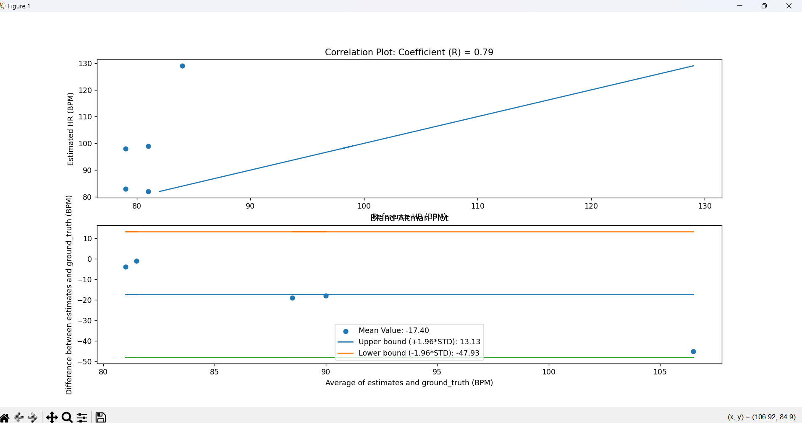

Name: Frederik Alexander Simon

PID: 10310072

## Lab 7 Tutorial 1:

In this tutorial I learned:

* using glob to retrieve the paths of the datafiles and then splitting them by "\\\\" because I am on a windos machine 
* create a search key to find right file 
* extract data out of the csv
* get heart rate out of the filename 
* estimate sampling rate 
* consider rejecting smaples that indicate a wrong sampling frequency used  
* do an easy processing and plot the data 
* for me it said that a few samples of the course were recorded at roughly 100Hz 

## Lab 7 Tutorial 2:

The objective of this tutorial was to get to know Gaussian Mixture Modeling and applying a data-driven approach in taking decisions.

In this tutorial I learned:

* how to train a Gaussian Mixture Model and let it predict the labels for the data
* you need to reshape numpy arrays from matrices to vectors
* training and testing on the same data is really bad 
* for our data this works really good 
* to test if the GMM is fitting our training data we can compute the histogram and look if the Gaussian probability density functions actually fit our data
* the GMM labels the data as 0 or 1 which for us indicates heartbeats 
* to detect the heartbeats we use to np.diff() to get an array filled with -1, 0 or 1s
* we look only at the ones as they represent a transition from no heartbeat to heartbeat 
* estimate heart rate using the amount of transitions detected 
* for me it works really good with exeption of the high heartbeat sample I recorded, because there is a region where he detects no heartbeats 
* this is probably because the values in the recorded sample are a bit squashed down in values and then look like noise when normalized
* use Leave-One-Subject-Out-Validation (LOSOV) to validate that we are doing the right thing by training the model on all training data expect for one of the subjects and then trying to predict the labels and compute the heatrate of one of the subjects 

## Lab 7 Challenge 1

In this challenge I did:

* reused the code of the second tutorial to get the file names and the content and train the model with the data of all students and then use the leave one subject out validation method to test the trained model 
* computed the error of each test data and squared it to in the end compute the RMSE 
* created an erray for estimates and 
* created an Bland-Altman plot and an Correlation plot to be able to evaluate the perfomance of our model 
* the RMSE for me is for me alwaxs close to 190 which is pretty high and therefore shows that the model's predictions deviate significantly from the ground truth set
* on the correlation plot you can see that the algorithm often estimates the heart rate to be much higher than its ground truth with estimated heartrates over 220 bpm which are and can not be true 
* The reason why I was getting this bad of results was becuase the first student had bad data and the model was tested on the first sample available 
* After removing the bad subject data and testing on a different subject the results look much better the RMSE is about 23 and the Correlation factor is about 0.8
* Furthermore the estimated heart rates are much more reasonable but sometimes a bit high which means the model detects more heartbeats
* The Band Altman plot shows that the algorithm constantly overestimates the heart rate and that this is more extreme for higher heartrates this coincides with the observations I made 

## Lab 7 Challenge 2

The goal of this Challenge was to build a Heart Rate Monitor that is trained by all the data in our data folder and then labels the live data coming from the ESP and compute the Heart Rate.

To achieve this I did:

* create a new module in my ECE16 library to make the training shown in the tutorial easily accessible 
* the module retrieves the paths and extracts the data from all the files in the data folder
* it then trains the model on all the data and returns the GMM
* I modified the tutorial code such that the model is trained on all the data and does not exclude subjects for validation 
* I also plot the histogram to be able to have a measure if my procedure makes sense 
* I added a new function in HR_Monitor class train() that basically calls the train_model() function from my new module and then returns the GMM model 
* Furthermore I added a method that processes the added data, predicts the labels and then using the function from my module estimates the heart rate and returns the heart rate estimate and the filtered data
* in my challenge 2 python file I then have the procedure we established during this course 
* I train my model by calling the train() function and then establish a connection with the MCU
* activate the ESP, receive the data and add it to the HR-monitor object 
* call the predict() method to process the data, label the data and then to estimate the data 
* send a string to the MCU, which I make dependent on the ppg value to avoid diplay of a heart rate computed on normalized noise
* on the MCU side I setup the usual things as well as the Photodetector 
* wait for activation and then send the time and ppg data to the PC 
* and display the heart rate string send by python

[Challenge 2 demonstration](https://youtu.be/NueA_fMCM70)

## Lab 7 Challenge 3

The goal of Challenge 3 was to combine all the different functionalities we have developed throughout the quarter

This is what I did:

The general Idea is to have a button that switches between Weather watch, Hr-monitor, Pedometer and idle detector and for controlling the functunalities of some of them a secon button that interacts with the different objects

* for the Weather Watch I created a class file that makes the functuanality easy to use and defined a main method that can be called and then the weather watch runs
* in the main program first the different objects for the weather watch, the idle detector, the HR-monitor and the Pedometer are created all with the same sampling frequency and amount of samples 
* a state variables is introduced to track and switch between the 4 different states and functionalities 
* communication is established 
* and the GMM model is trained for the heart rate monitor 
* in the while loop at first the message from the MCU is received and processed
* if the state button has been pressed the state is switched and otherwise if the MCU sent reasonable data the data is split in: time, ax, ay , az, ppg 
* if the state is 0 the code just runs the weather watch 
* if the state 1 it runs code similar to Lab 7 Challenge 2, which means it adds the data to the HR-monitor and estimates the heart rate with the help of ML
* if the state is 2 the sent data is added to the pedometer object and the data is processed and the steps are estimated
* if the state is 3 the method idle.run() is called and this runs the idle detector 
* i spent a lot of time debuggin because the communications parts implemented in the old OOP modules interfered with the communication of Challenge 3 
* In addition I had problems detecting button pushes when I also sent ppg and accelerometer data 
* without streaming data from the MCU the weather watch works and the pyhton switches through the states but as soon as I send data the buttons do not function anymore 

